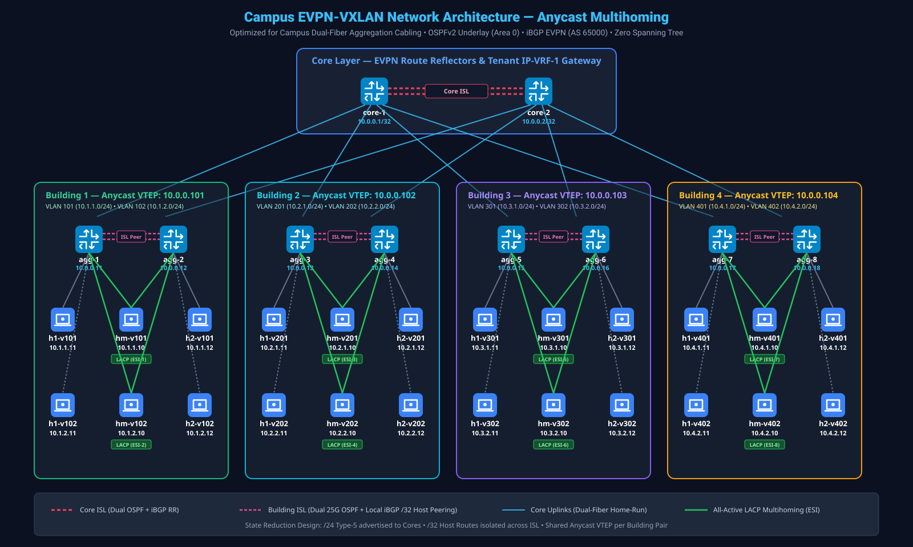
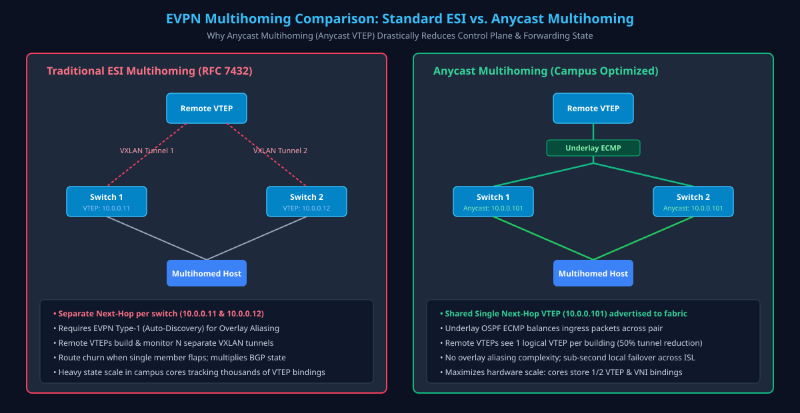

# Campus EVPN-VXLAN Network Architecture — Anycast Multihoming

A high-performance, scalable Campus EVPN-VXLAN network architecture deployed on Nokia SR Linux. This design is engineered specifically around the physical cabling realities of enterprise campus environments, combining OSPFv2 underlay transit, iBGP EVPN overlay control plane, and EVPN Anycast Multihoming to achieve active-active forwarding, sub-second failure recovery, and state reduction.

---

## 1. Architectural Overview & Campus Cabling Model

[](https://raw.githubusercontent.com/andywhitaker/campus-evpn-anycast-mh/main/images/campus-architecture.svg)

### 1.1 The Campus Cabling Reality vs. Data Center Fabrics
Data center network architectures typically rely on full-mesh Clos leaf-spine topologies where every leaf switch maintains homerun fiber connections to every spine switch. 

Real-world enterprise campus networks almost never have full-mesh cabling:
- **Dual-Fiber Constraints**: Campus buildings typically have only two fiber pairs (or two conduit pathways) back to the central campus core location.
- **Physical Topology**: Each building aggregation switch connects to only **one** of the two core switches (`agg-1` to `core-1`, `agg-2` to `core-2`). There are no direct cross-connections from an individual aggregation switch to both core switches.
- **Why This Architecture Supports It**: Rather than forcing an impractical full-mesh fiber requirement, this architecture natively embraces the two-fiber-pair model. Dual core switches provide campus-wide routing and route reflection, while building aggregation pairs use dedicated Inter-Switch Links (ISLs) and Anycast Multihoming to deliver seamless redundancy and active-active host connectivity.

---

## 2. Core Architecture Elements & Protocols

### 2.1 The Cross Links (ISLs)
The architecture uses two tiers of Inter-Switch Links (ISLs) that are fundamental to forwarding and survivability:

1. **Core Inter-Switch Links (Core ISLs)**:
   - Dual links connecting `core-1` and `core-2` (`ethernet-1/1` and `ethernet-1/2`).
   - Carries underlay OSPF transit between the two core halves with Equal-Cost Multi-Pathing (ECMP).
   - Carries the overlay iBGP EVPN Route Reflector peering session between `core-1` and `core-2`.
2. **Aggregation Inter-Switch Links (Building ISLs)**:
   - Dual links connecting the two switches within each building aggregation pair (`agg-1` <-> `agg-2`, `agg-3` <-> `agg-4`, etc.).
   - **Why Building ISLs are Critical**: Because each aggregation switch connects to only one core switch, an uplink failure (e.g., `agg-1` losing its link to `core-1`) requires `agg-1` to transit traffic across the building ISL to `agg-2` to reach `core-2`.
   - The building ISL carries:
     - Underlay OSPF transit.
     - Direct, point-to-point iBGP EVPN peering session between aggregation partners.
     - VXLAN data-plane traffic for failure recovery and local inter-switch forwarding.

### 2.2 Underlay & Overlay Protocols
- **Underlay Protocol: Single-Area OSPFv2 (Area `0.0.0.0`)**:
  - Runs across all inter-switch physical links (Core ISLs, Core-Agg uplinks, and Building ISLs) configured as point-to-point `/31` subnets.
  - Advertises individual device loopbacks (`lo0.0`, `10.0.0.x/32`) and shared Anycast VTEP loopbacks (`lo0.1`, `10.0.0.10x/32`).
  - ECMP is active across dual links, delivering dynamic load distribution and fast convergence without Spanning Tree Protocol (STP).
- **Overlay Protocol: Multiprotocol iBGP EVPN (AS 65000)**:
  - Deployed in a hierarchical Route Reflector (RR) topology.
  - `core-1` and `core-2` serve as redundant Route Reflectors for all aggregation switches.
  - Distributes MAC-IP (Type-2), Ethernet Auto-Discovery (Type-1), Ethernet Segment (Type-4), and IP Prefix (Type-5) routes, replacing flood-and-learn mechanisms with control-plane advertisements.

### 2.3 Direct ISL BGP Peering
Direct point-to-point iBGP EVPN sessions are established across the Inter-Switch Links at both the core and aggregation tiers:

- **Core ISL BGP Peering (`core-1` <-> `core-2`)**:
  - `core-1` and `core-2` establish a direct point-to-point iBGP EVPN peering session across the Core ISL (configured under peer group `rr-peer` between loopbacks `10.0.0.1` and `10.0.0.2`).
  - In a production campus deployment, EVPN will terminate on the cores as well for gateway functionality (e.g., default gateway for centralized services, campus border routing, firewall insertion, and WAN/data-center interconnect).
  - This direct peering ensures complete EVPN control-plane synchronization between both Route Reflectors and provides path redundancy across the core tier.
- **Building ISL BGP Peering (`agg` Partners)**:
  - In addition to peering with the Route Reflectors on the cores, each aggregation switch establishes a direct point-to-point iBGP EVPN session across the building ISL with its partner (`agg-1` peers directly with `agg-2`, `agg-3` with `agg-4`, etc., under peer group `overlay-isl`).
  - **Why Aggregation ISL Peering is Needed**: To optimize routing tables and isolate state, single-homed host routes (`/32`) learned via ARP are **not** advertised to the core Route Reflectors.
  - **Routing Policy Split**:
    - **Export to Cores**: Aggregation switches export summarized `/24` building subnets (Type-5 prefix routes) and reject all `/32` single-homed host routes.
    - **Export across ISL**: Aggregation switches export `/32` single-homed host routes directly to their ISL partner.
    - **Result**: If traffic arrives at `agg-2` destined for a host single-homed to `agg-1` (`10.1.1.11`), `agg-2` knows the host route via the ISL session and forwards it across the building ISL without core involvement.

### 2.4 EVPN Optimized Inter-Subnet Multicast (OISM) & SBD Architecture
In traditional multicast over EVPN, forwarding multicast streams between distinct Layer-2 subnets often requires extending flat broadcast domains campus-wide or routing through centralized Rendezvous Points (RPs) and hair-pinning across core routers.

This architecture deploys **EVPN Optimized Inter-Subnet Multicast (OISM)** based on RFC 9251:
- **Supplementary Broadcast Domain (SBD VNI 50000)**:
  - Configured as `mac-vrf-50000` with VNI `50000` across all 8 aggregation switches.
  - Acts as a shared, campus-wide transit broadcast domain for inter-subnet multicast traffic.
  - MAC address advertisement is suppressed (`routes bridge-table mac-ip advertise false`) as the SBD is dedicated solely to inter-subnet multicast transit.
- **Full Unnumbered IRB (`irb0.0`)**:
  - Each aggregation switch binds an unnumbered IRB subinterface (`irb0.0`, configured with `evpn-interface-ful-unnumbered`) between `mac-vrf-50000` and the tenant VRF `ip-vrf-1`.
  - Enables routing of multicast traffic between local tenant VLANs and the campus SBD without allocating explicit IP subnets to the SBD itself.
- **PIM IPv4 with `multicast-senders always`**:
  - PIM IPv4 is enabled on `irb0.0` within `ip-vrf-1` with `multicast-senders always`.
  - Ensures that when an aggregation switch receives multicast traffic from a local source on any tenant VLAN, it routes the traffic onto the SBD fabric so that remote aggregation switches can receive and route it locally to their subscribers.
- **Selective Multicast Ethernet Tag (SMET - BGP EVPN Route Type 6)**:
  - When downstream hosts signal multicast group interest via IGMP, aggregation switches generate EVPN Route Type 6 (SMET) advertisements.
  - Core Route Reflectors (`core-1`, `core-2`) reflect these SMET routes to all aggregation peers.
  - **Selective Distribution**: Multicast traffic over SBD VNI 50000 is forwarded across the fabric only to aggregation switches with active group subscribers, avoiding flooding unneeded multicast traffic campus-wide.
- **Distributed IGMP Snooping Queriers**:
  - Each local tenant MAC-VRF (`mac-vrf-101`, `mac-vrf-102`, etc.) runs IGMP snooping with `send-queries true` on host- and LAG-facing interfaces.
  - Aggregation switches actively query downstream hosts every 125 seconds, maintaining group membership tables locally and synchronizing them into EVPN.

---

## 3. Anycast Multihoming vs. Standard ESI Multihoming

[](https://raw.githubusercontent.com/andywhitaker/campus-evpn-anycast-mh/main/images/anycast-multihoming.svg)

### 3.1 Traditional ESI Multihoming (RFC 7432)
In standard ESI multihoming:
- Each switch in a multihomed pair has its own unique VTEP IP address.
- When an active-active Ethernet Segment (ESI) is configured, both switches advertise Type-4 (ES) and Type-1 (Auto-Discovery per ESI) routes with their individual VTEP IPs.
- Remote VTEPs must ingest both advertisements, construct overlay aliasing tables, and program two separate VXLAN tunnels for the multihomed endpoint.
- If a link flaps, EVPN withdrawals cascade across the entire campus overlay, creating control-plane churn and multiplying VTEP/VNI tunnel state across core and leaf hardware.

### 3.2 Anycast Multihoming (Anycast VTEP)
This architecture employs **Anycast Multihoming**:
- **Shared Anycast VTEP IP**: Both switches in an aggregation pair share an identical Anycast VTEP IP configured on a secondary loopback subinterface (`lo0.1`):
  - Building 1 (`agg-1` & `agg-2`): `10.0.0.101/32`
  - Building 2 (`agg-3` & `agg-4`): `10.0.0.102/32`
  - Building 3 (`agg-5` & `agg-6`): `10.0.0.103/32`
  - Building 4 (`agg-7` & `agg-8`): `10.0.0.104/32`
- **Underlay ECMP Load Balancing**: OSPF advertises the shared `/32` Anycast IP from both switches. Core switches see two equal-cost paths to the Anycast VTEP and distribute ingress VXLAN packets at the underlay transport layer.
- **Anycast BGP Next-Hop**: On multihomed Ethernet Segments, the switch explicitly sets:
  ```text
  anycast-multi-homing {
      ip-address 10.0.0.101
  }
  ```
  EVPN route advertisements for multihomed endpoints use the shared Anycast VTEP IP as the BGP Next-Hop.
- **Single Logical VTEP**: Remote VTEPs and core switches treat the entire building pair as a single logical VTEP, eliminating the need for overlay aliasing calculations and reducing BGP EVPN route state.

### 3.3 Multi-Chassis LACP Coordination
Linux hosts in this lab are standing in to demonstrate downstream access switch connectivity to the aggregation layer using dual connections and LACP. Endpoints multihome to both aggregation switches using standard IEEE 802.3ad dynamic link aggregation (`bond0` on hosts, or an access switch LAG uplink). Both switches in the aggregation pair configure matching LACP parameters on their respective LAG interfaces:
- Matching LACP System ID / Partner MAC: `00:00:00:01:01:01`
- Matching Admin Key / Partner Key: `101`
- Result: The downstream device sees both physical links as belonging to the **exact same active aggregator** without requiring proprietary vendor clustering protocols (no MLAG, no VPC, no switch stacking).

---

## 4. Architectural Choices for Scalability & State Reduction

The table below summarizes the design decisions made to minimize hardware table consumption and control-plane state:

| Architectural Mechanism | Implementation | State Reduction & Scalability Benefit |
| :--- | :--- | :--- |
| **Shared Anycast VTEP per Building** | Secondary loopback `lo0.1` (`10.0.0.10x/32`) shared by aggregation partner switches. | Halves the number of VTEP endpoints and tunnel bindings tracked by core switches and remote pairs across the campus. |
| **Localized MAC-VRFs (No Spanned L2)** | Building-specific VLANs/MAC-VRFs (VLAN 101/102 only on Pair 1, 201/202 only on Pair 2, etc.). | Prevents campus-wide Layer-2 broadcast domains. Eliminates Type-2 MAC route flooding between buildings. |
| **Hierarchical Route Filtering (/24 vs /32)** | Aggregation switches export `/24` subnets to Cores and strictly filter out `/32` host routes. | Keeps Core routing tables minimal (exactly eight `/24` prefix routes for the entire campus) regardless of how many thousands of hosts are online. |
| **Direct ISL iBGP Peering** | Dedicated point-to-point iBGP EVPN session across the building ISL. | Exchanges single-homed `/32` host routes exclusively between building partners, providing optimal forwarding without leaking state to cores. |
| **Dynamic ARP Host-Route Population** | `ipv4 arp host-route populate dynamic` configured on IRB subinterfaces. | Host routes are populated into the IP-VRF routing table on-demand only when endpoints actively communicate, avoiding stale routing entries. |
| **EVPN OISM with SBD (VNI 50000)** | SBD `mac-vrf-50000`, unnumbered `irb0.0`, PIM `multicast-senders always`, and BGP EVPN Type-6 SMET routes. | Prevents inter-building multicast hair-pinning. Eliminates duplicate packets on multi-access links. Distributes cross-campus multicast exclusively to VTEPs with active receivers. |

---

## 5. End-to-End Validation Guide

To validate the campus network, execute the following commands:

---

### Phase 1: Physical Interfaces & Underlay OSPF Validation

#### Step 1.1: Verify Physical Interface Operational States
Verify that all inter-switch physical interfaces are UP and running at operational speed:
```text
A:admin@core-1# show interface ethernet-1/1 brief
+---------------+-------------+------------+--------------------+
|   Interface   | Admin-state | Oper-state |       Speed        |
+===============+=============+============+====================+
| ethernet-1/1  | enable      | up         | 100G               |
+---------------+-------------+------------+--------------------+
```

#### Step 1.2: Verify OSPF Underlay Neighbors
On **`core-1`**, six OSPF neighbors must be in state `full` (2 over the Core ISL to `core-2`, and 4 uplinks to `agg-1`, `agg-3`, `agg-5`, `agg-7`):
```text
A:admin@core-1# show network-instance default protocols ospf neighbor
========================================================================================================================================================================================================
Net-Inst default OSPFv2 Instance underlay Neighbors
========================================================================================================================================================================================================
+---------------------------------------------------------------------------------------+
| Interface-Name         Rtr Id            State        Pri   RetxQ    Time Before Dead |
+=======================================================================================+
| ethernet-1/1.0         10.0.0.2          full         1     0        35               |
| ethernet-1/2.0         10.0.0.2          full         1     0        36               |
| ethernet-1/3.0         10.0.0.11         full         1     0        35               |
| ethernet-1/4.0         10.0.0.13         full         1     0        38               |
| ethernet-1/5.0         10.0.0.15         full         1     0        36               |
| ethernet-1/6.0         10.0.0.17         full         1     0        30               |
+---------------------------------------------------------------------------------------+
No. of Neighbors: 6
```

On **`agg-1`**, three OSPF neighbors must be in state `full` (2 over the building ISL to `agg-2`, and 1 uplink to `core-1`):
```text
A:admin@agg-1# show network-instance default protocols ospf neighbor
========================================================================================================================================================================================================
Net-Inst default OSPFv2 Instance underlay Neighbors
========================================================================================================================================================================================================
+---------------------------------------------------------------------------------------+
| Interface-Name         Rtr Id            State        Pri   RetxQ    Time Before Dead |
+=======================================================================================+
| ethernet-1/1.0         10.0.0.12         full         1     0        38               |
| ethernet-1/2.0         10.0.0.12         full         1     0        38               |
| ethernet-1/3.0         10.0.0.1          full         1     0        31               |
+---------------------------------------------------------------------------------------+
No. of Neighbors: 3
```

#### Step 1.3: Verify Underlay Loopback & Anycast VTEP Reachability
Verify that the default network-instance routing table has learned all switch loopbacks and Anycast VTEP addresses via OSPF with multipath:
```text
A:admin@core-1# show network-instance default route-table ipv4-unicast summary
========================================================================================================================================================================================================
IPv4 unicast route table summary for network-instance "default"
========================================================================================================================================================================================================
Total active routes       : 28
OSPF routes               : 16 (including loopbacks 10.0.0.x/32 and Anycast VTEPs 10.0.0.10x/32)
Multipath (ECMP) routes   : 8
```

---

### Phase 2: BGP EVPN Overlay Validation

#### Step 2.1: Verify Route Reflector Sessions on Core
On Route Reflector **`core-1`**, all 9 iBGP EVPN sessions must be in state `established` (1 peer session to `core-2` and 8 client sessions to `agg-1` through `agg-8`):
```text
A:admin@core-1# show network-instance default protocols bgp neighbor
+----------------------+--------------------------------+----------------------+--------+------------+------------------+------------------+----------------------------------------------+
|       Net-Inst       |              Peer              |        Group         | Flags  |  Peer-AS   |      State       |      Uptime      |           AFI/SAFI [Rx/Active/Tx]            |
+======================+================================+======================+========+============+==================+==================+==============================================+
| default              | 10.0.0.2                       | rr-peer              | S      | 65000      | established      | 0d:0h:5m:4s      | evpn [136/0/136]                             |
| default              | 10.0.0.11                      | rr-clients           | S      | 65000      | established      | 0d:0h:4m:51s     | evpn [17/2/119]                              |
| default              | 10.0.0.12                      | rr-clients           | S      | 65000      | established      | 0d:0h:4m:59s     | evpn [17/2/119]                              |
| default              | 10.0.0.13                      | rr-clients           | S      | 65000      | established      | 0d:0h:4m:58s     | evpn [17/2/119]                              |
| default              | 10.0.0.14                      | rr-clients           | S      | 65000      | established      | 0d:0h:4m:51s     | evpn [17/2/119]                              |
| default              | 10.0.0.15                      | rr-clients           | S      | 65000      | established      | 0d:0h:4m:57s     | evpn [17/2/119]                              |
| default              | 10.0.0.16                      | rr-clients           | S      | 65000      | established      | 0d:0h:4m:50s     | evpn [17/2/119]                              |
| default              | 10.0.0.17                      | rr-clients           | S      | 65000      | established      | 0d:0h:4m:56s     | evpn [17/2/119]                              |
| default              | 10.0.0.18                      | rr-clients           | S      | 65000      | established      | 0d:0h:4m:51s     | evpn [17/2/119]                              |
+----------------------+--------------------------------+----------------------+--------+------------+------------------+------------------+----------------------------------------------+
Summary: 9 configured neighbors, 9 configured sessions are established, 0 disabled peers
```

#### Step 2.2: Verify Overlay Sessions & Direct ISL Peering on Aggregation
On **`agg-1`**, 3 iBGP EVPN sessions must be established: 2 uplinks to `core-1` and `core-2` (group `overlay-cores`), and 1 direct session across the ISL to partner `agg-2` (group `overlay-isl`):
```text
A:admin@agg-1# show network-instance default protocols bgp neighbor
+----------------------+--------------------------------+----------------------+--------+------------+------------------+------------------+----------------------------------------------+
|       Net-Inst       |              Peer              |        Group         | Flags  |  Peer-AS   |      State       |      Uptime      |           AFI/SAFI [Rx/Active/Tx]            |
+======================+================================+======================+========+============+==================+==================+==============================================+
| default              | 10.0.0.1                       | overlay-cores        | S      | 65000      | established      | 0d:0h:4m:56s     | evpn [28/12/17]                              |
| default              | 10.0.0.2                       | overlay-cores        | S      | 65000      | established      | 0d:0h:4m:51s     | evpn [28/0/17]                               |
| default              | 10.0.0.12                      | overlay-isl          | S      | 65000      | established      | 0d:0h:4m:58s     | evpn [19/17/21]                              |
+----------------------+--------------------------------+----------------------+--------+------------+------------------+------------------+----------------------------------------------+
Summary: 3 configured neighbors, 3 configured sessions are established, 0 disabled peers
```

---

### Phase 3: Anycast Multihoming & Ethernet Segments Validation

#### Step 3.1: Verify Ethernet Segments and Anycast Multihoming State
On **`agg-1`**, query Ethernet Segments. Verify the critical Anycast Multihoming parameters:
- `Multi-homing: all-active`: Both switches actively forward traffic across the LAG.
- `anycast-multi-homing ip-address: 10.0.0.101`: EVPN routes are advertised with the shared Anycast VTEP.
- `DF Candidates`: Shows both switches participating in Designated Forwarder election, with `10.0.0.11` elected DF (preference 200) and `10.0.0.12` non-DF (preference 100):
```text
A:admin@agg-1# show system network-instance ethernet-segments detail
========================================================================================================================================================================================================
Ethernet Segment
========================================================================================================================================================================================================
Name                 : ES-LAG1
Admin State          : enable              Oper State        : up
ESI                  : 00:01:01:00:00:00:00:00:00:01
Multi-homing         : all-active          Oper Multi-homing : all-active
Interface            : lag1
DF Election          : preference          Oper DF Election  : preference
Anycast Multi-Homing : 10.0.0.101
========================================================================================================================================================================================================
DF Candidates
========================================================================================================================================================================================================
Network-instances:
    mac-vrf-101
     Candidates : 10.0.0.11 (DF), 10.0.0.12
     Interface : lag1.0
========================================================================================================================================================================================================
Ethernet Segment
========================================================================================================================================================================================================
Name                 : ES-LAG2
Admin State          : enable              Oper State        : up
ESI                  : 00:01:01:00:00:00:00:00:00:02
Multi-homing         : all-active          Oper Multi-homing : all-active
Interface            : lag2
DF Election          : preference          Oper DF Election  : preference
Anycast Multi-Homing : 10.0.0.101
========================================================================================================================================================================================================
DF Candidates
========================================================================================================================================================================================================
Network-instances:
    mac-vrf-102
     Candidates : 10.0.0.11 (DF), 10.0.0.12
     Interface : lag2.0
========================================================================================================================================================================================================
```

#### Step 3.2: Verify Switch LAG Operational State
Confirm that member interfaces are operational in `lag1` and `lag2`:
```text
A:admin@agg-1# show lag
========================================================================================================================================================================================================
lag1 is up, Aggregate speed 25000 Mbps, min links 1
+-----------------+------------+---------------------------+
|   Member Name   | oper-state |     oper-down-reason      |
+=================+============+===========================+
| ethernet-1/6    | up         |                           |
+-----------------+------------+---------------------------+
lag2 is up, Aggregate speed 25000 Mbps, min links 1
+-----------------+------------+---------------------------+
|   Member Name   | oper-state |     oper-down-reason      |
+=================+============+===========================+
| ethernet-1/7    | up         |                           |
+-----------------+------------+---------------------------+
Summary: 2 LAG interfaces are up, 0 are down
```

#### Step 3.3: Verify Multi-Chassis LACP from Linux Host
Inspect `/proc/net/bonding/bond0` on multihomed host `hm-v101`. Verify that both `eth1` (connected to `agg-1`) and `eth2` (connected to `agg-2`) are bundled into the **exact same active aggregator**:
- `Number of ports: 2`
- `port state: 63` on both slaves (LACP Collecting and Distributing)
- Matching `Partner Key: 101` and `Partner Mac Address: 00:00:00:01:01:01`:
```text
root@hm-v101:~# cat /proc/net/bonding/bond0
Ethernet Channel Bonding Driver: v6.8.0-138-generic

Bonding Mode: IEEE 802.3ad Dynamic link aggregation
Transmit Hash Policy: layer3+4 (1)
MII Status: up

802.3ad info
LACP active: on
LACP rate: fast
Active Aggregator Info:
	Aggregator ID: 1
	Number of ports: 2
	Actor Key: 15
	Partner Key: 101
	Partner Mac Address: 00:00:00:01:01:01

Slave Interface: eth1
MII Status: up
details actor lacp pdu:
    port state: 63
details partner lacp pdu:
    system mac address: 00:00:00:01:01:01
    oper key: 101
    port state: 63

Slave Interface: eth2
MII Status: up
details actor lacp pdu:
    port state: 63
details partner lacp pdu:
    system mac address: 00:00:00:01:01:01
    oper key: 101
    port state: 63
```

---

### Phase 4: EVPN Route Architecture & State Reduction Verification

#### Step 4.1: Verify Core Route Table (Zero /32 Host Routes Leaked)
On **`core-1`**, verify Type-5 IP Prefix routes. The core must contain **only** the summarized `/24` building subnets. Not a single `/32` host route is present:
```text
A:admin@core-1# show network-instance default protocols bgp routes evpn route-type 5 summary
BGP Router ID: 10.0.0.1      AS: 65000      Local AS: 65000
Type 5 IP Prefix Routes
+--------+----------------------------+------------+---------------------+----------------------------+--------+----------------------------+----------------------------+----------------------------+
| Status |    Route-distinguisher     |   Tag-ID   |     IP-address      |          neighbor          | Path-id|          Next-Hop          |           Label            |          Gateway           |
+========+============================+============+=====================+============================+========+============================+============================+============================+
| u*>    | 10.0.0.11:1000             | 0          | 10.1.1.0/24         | 10.0.0.11                  | 0      | 10.0.0.11                  | 1000                       | 0.0.0.0                    |
| u*>    | 10.0.0.11:1000             | 0          | 10.1.2.0/24         | 10.0.0.11                  | 0      | 10.0.0.11                  | 1000                       | 0.0.0.0                    |
| u*>    | 10.0.0.12:1000             | 0          | 10.1.1.0/24         | 10.0.0.12                  | 0      | 10.0.0.12                  | 1000                       | 0.0.0.0                    |
| u*>    | 10.0.0.12:1000             | 0          | 10.1.2.0/24         | 10.0.0.12                  | 0      | 10.0.0.12                  | 1000                       | 0.0.0.0                    |
| u*>    | 10.0.0.13:1000             | 0          | 10.2.1.0/24         | 10.0.0.13                  | 0      | 10.0.0.13                  | 1000                       | 0.0.0.0                    |
| u*>    | 10.0.0.13:1000             | 0          | 10.2.2.0/24         | 10.0.0.13                  | 0      | 10.0.0.13                  | 1000                       | 0.0.0.0                    |
| u*>    | 10.0.0.14:1000             | 0          | 10.2.1.0/24         | 10.0.0.14                  | 0      | 10.0.0.14                  | 1000                       | 0.0.0.0                    |
| u*>    | 10.0.0.14:1000             | 0          | 10.2.2.0/24         | 10.0.0.14                  | 0      | 10.0.0.14                  | 1000                       | 0.0.0.0                    |
| u*>    | 10.0.0.15:1000             | 0          | 10.3.1.0/24         | 10.0.0.15                  | 0      | 10.0.0.15                  | 1000                       | 0.0.0.0                    |
| u*>    | 10.0.0.15:1000             | 0          | 10.3.2.0/24         | 10.0.0.15                  | 0      | 10.0.0.15                  | 1000                       | 0.0.0.0                    |
| u*>    | 10.0.0.16:1000             | 0          | 10.3.1.0/24         | 10.0.0.16                  | 0      | 10.0.0.16                  | 1000                       | 0.0.0.0                    |
| u*>    | 10.0.0.16:1000             | 0          | 10.3.2.0/24         | 10.0.0.16                  | 0      | 10.0.0.16                  | 1000                       | 0.0.0.0                    |
| u*>    | 10.0.0.17:1000             | 0          | 10.4.1.0/24         | 10.0.0.17                  | 0      | 10.0.0.17                  | 1000                       | 0.0.0.0                    |
| u*>    | 10.0.0.17:1000             | 0          | 10.4.2.0/24         | 10.0.0.17                  | 0      | 10.0.0.17                  | 1000                       | 0.0.0.0                    |
| u*>    | 10.0.0.18:1000             | 0          | 10.4.1.0/24         | 10.0.0.18                  | 0      | 10.0.0.18                  | 1000                       | 0.0.0.0                    |
| u*>    | 10.0.0.18:1000             | 0          | 10.4.2.0/24         | 10.0.0.18                  | 0      | 10.0.0.18                  | 1000                       | 0.0.0.0                    |
+--------+----------------------------+------------+---------------------+----------------------------+--------+----------------------------+----------------------------+----------------------------+
32 IP Prefix routes (16 used, 32 valid, 0 host routes /32 leaked)
```

#### Step 4.2: Verify Aggregation Route Table (ISL-Learned Single-Homed Host Routes)
On **`agg-1`**, verify Type-5 routes. Notice that `agg-1` learns remote building subnets from the cores, but receives partner single-homed host routes (`10.1.1.12/32`, `10.1.2.10/32`, `10.1.2.12/32`) **exclusively from neighbor 10.0.0.12 (`agg-2`) over the direct ISL**:
```text
A:admin@agg-1# show network-instance default protocols bgp routes evpn route-type 5 summary
+--------+----------------------------+------------+---------------------+----------------------------+--------+----------------------------+----------------------------+----------------------------+
| Status |    Route-distinguisher     |   Tag-ID   |     IP-address      |          neighbor          | Path-id|          Next-Hop          |           Label            |          Gateway           |
+========+============================+============+=====================+============================+========+============================+============================+============================+
| u*>    | 10.0.0.12:1000             | 0          | 10.1.1.0/24         | 10.0.0.12                  | 0      | 10.0.0.12                  | 1000                       | 0.0.0.0                    |
| u*>    | 10.0.0.12:1000             | 0          | 10.1.2.0/24         | 10.0.0.12                  | 0      | 10.0.0.12                  | 1000                       | 0.0.0.0                    |
| u*>    | 10.0.0.12:1000             | 0          | 10.1.1.12/32        | 10.0.0.12                  | 0      | 10.0.0.12                  | 1000                       | 0.0.0.0                    |
| u*>    | 10.0.0.12:1000             | 0          | 10.1.2.10/32        | 10.0.0.12                  | 0      | 10.0.0.12                  | 1000                       | 0.0.0.0                    |
| u*>    | 10.0.0.12:1000             | 0          | 10.1.2.12/32        | 10.0.0.12                  | 0      | 10.0.0.12                  | 1000                       | 0.0.0.0                    |
| u*>    | 10.0.0.13:1000             | 0          | 10.2.1.0/24         | 10.0.0.1                   | 0      | 10.0.0.13                  | 1000                       | 0.0.0.0                    |
| u*>    | 10.0.0.13:1000             | 0          | 10.2.2.0/24         | 10.0.0.1                   | 0      | 10.0.0.13                  | 1000                       | 0.0.0.0                    |
| u*>    | 10.0.0.14:1000             | 0          | 10.2.1.0/24         | 10.0.0.1                   | 0      | 10.0.0.14                  | 1000                       | 0.0.0.0                    |
| u*>    | 10.0.0.14:1000             | 0          | 10.2.2.0/24         | 10.0.0.1                   | 0      | 10.0.0.14                  | 1000                       | 0.0.0.0                    |
+--------+----------------------------+------------+---------------------+----------------------------+--------+----------------------------+----------------------------+----------------------------+
```

---

### Phase 5: Data Plane Forwarding, ARP & MAC Tables

#### Step 5.1: Verify Layer-2 MAC Learning in Local MAC-VRF
On **`agg-1`**, verify MAC address learning for `mac-vrf-101`:
```text
A:admin@agg-1# show network-instance mac-vrf-101 mac-table all
========================================================================================================================================================================================================
MAC table of network instance mac-vrf-101
========================================================================================================================================================================================================
+-------------------+--------------+---------+--------------------+--------------------+
|    MAC Address    | Destination  |  Type   |    Originator      |       Aging        |
+===================+==============+=========+====================+====================+
| aa:c1:ab:01:01:11 | ethernet-1/4 | dynamic |                    | 285                |
| aa:c1:ab:01:01:10 | lag1         | dynamic |                    | 290                |
+-------------------+--------------+---------+--------------------+--------------------+
```

#### Step 5.2: Verify Dynamic ARP Host Routes on IRB
On **`agg-1`**, check the dynamic ARP table on `irb0.101` and verify route population:
```text
A:admin@agg-1# show network-instance default arp-nd
========================================================================================================================================================================================================
ARP and ND Neighbor Cache
========================================================================================================================================================================================================
+-----------------+---------------+-------------------+--------+-----------+
|   IP Address    |  Interface    |    MAC Address    | Origin |   State   |
+=================+===============+===================+========+===========+
| 10.1.1.11       | irb0.101      | aa:c1:ab:01:01:11 | dynamic| reachable |
| 10.1.1.10       | irb0.101      | aa:c1:ab:01:01:10 | dynamic| reachable |
+-----------------+---------------+-------------------+--------+-----------+
```

#### Step 5.3: Automated Concurrent Full-Mesh Ping Traffic Verification
Run the asynchronous multi-host ping generator from single-homed host `h1-v101` (`10.1.1.11`) to ping all 23 other hosts in the fabric concurrently:
```text
root@h1-v101:~# ping_hosts --count 5 --timeout 1
========================================================================================
  Campus EVPN-VXLAN Network — Asynchronous Multi-Host Ping Traffic Generator
========================================================================================
  Source Host : h1-v101 (10.1.1.11) | Pair 1 | VLAN 101 [Single-Homed (agg-1)]
  Parameters  : 5 packets per target | 1s timeout per packet | Asynchronous (Concurrent)
  Target Pool : 23 host targets
----------------------------------------------------------------------------------------
  Target     | Pair  | VLAN  | IP Address   | Sent | Recv | Loss   | Avg RTT   | Status  
  ------------------------------------------------------------------------------------
  h2-v101    | P1    | 101   | 10.1.1.12    | 5    | 5    | 0%     | 1.24 ms   | [PASS]
  hm-v101    | P1    | 101   | 10.1.1.10    | 5    | 5    | 0%     | 0.51 ms   | [PASS]
  h1-v102    | P1    | 102   | 10.1.2.11    | 5    | 5    | 0%     | 1.15 ms   | [PASS]
  h2-v102    | P1    | 102   | 10.1.2.12    | 5    | 5    | 0%     | 1.23 ms   | [PASS]
  hm-v102    | P1    | 102   | 10.1.2.10    | 5    | 5    | 0%     | 0.87 ms   | [PASS]
  h1-v201    | P2    | 201   | 10.2.1.11    | 5    | 5    | 0%     | 1.14 ms   | [PASS]
  h2-v201    | P2    | 201   | 10.2.1.12    | 5    | 5    | 0%     | 2.10 ms   | [PASS]
  hm-v201    | P2    | 201   | 10.2.1.10    | 5    | 5    | 0%     | 1.28 ms   | [PASS]
  h1-v202    | P2    | 202   | 10.2.2.11    | 5    | 5    | 0%     | 1.15 ms   | [PASS]
  h2-v202    | P2    | 202   | 10.2.2.12    | 5    | 5    | 0%     | 1.70 ms   | [PASS]
  hm-v202    | P2    | 202   | 10.2.2.10    | 5    | 5    | 0%     | 1.17 ms   | [PASS]
  h1-v301    | P3    | 301   | 10.3.1.11    | 5    | 5    | 0%     | 1.24 ms   | [PASS]
  h2-v301    | P3    | 301   | 10.3.1.12    | 5    | 5    | 0%     | 1.56 ms   | [PASS]
  hm-v301    | P3    | 301   | 10.3.1.10    | 5    | 5    | 0%     | 1.45 ms   | [PASS]
  h1-v302    | P3    | 302   | 10.3.2.11    | 5    | 5    | 0%     | 1.14 ms   | [PASS]
  h2-v302    | P3    | 302   | 10.3.2.12    | 5    | 5    | 0%     | 1.41 ms   | [PASS]
  hm-v302    | P3    | 302   | 10.3.2.10    | 5    | 5    | 0%     | 1.24 ms   | [PASS]
  h1-v401    | P4    | 401   | 10.4.1.11    | 5    | 5    | 0%     | 1.05 ms   | [PASS]
  h2-v401    | P4    | 401   | 10.4.1.12    | 5    | 5    | 0%     | 1.62 ms   | [PASS]
  hm-v401    | P4    | 401   | 10.4.1.10    | 5    | 5    | 0%     | 1.61 ms   | [PASS]
  h1-v402    | P4    | 402   | 10.4.2.11    | 5    | 5    | 0%     | 1.10 ms   | [PASS]
  h2-v402    | P4    | 402   | 10.4.2.12    | 5    | 5    | 0%     | 1.41 ms   | [PASS]
  hm-v402    | P4    | 402   | 10.4.2.10    | 5    | 5    | 0%     | 1.28 ms   | [PASS]
  ------------------------------------------------------------------------------------
Execution Summary:
  Targets Tested : 23
  Success Rate   : 23/23 (100.0%)
  Wall Duration  : 4.13 seconds (all 23 targets pinged concurrently)
========================================================================================
```

---

### Phase 6: Automated Test Suite & Resiliency Verification

#### Step 6.1: Run Comprehensive Automated Validation Suite
Execute `python3 scripts/validate.py` to run automated verification across all 7 test suites:
```text
$ python3 scripts/validate.py
====================================================================================================
#                 Campus EVPN-VXLAN Automated Verification & Acceptance Suite                      #
====================================================================================================
[SUITE 1/7] OSPF Underlay Verification across 10 Nodes
----------------------------------------------------------------------------------------------------
  [PASS] core-1: 6 OSPF neighbors in FULL state
  [PASS] core-2: 6 OSPF neighbors in FULL state
  [PASS] agg-1: 3 OSPF neighbors in FULL state
  [PASS] agg-2: 3 OSPF neighbors in FULL state
  [PASS] agg-3: 3 OSPF neighbors in FULL state
  [PASS] agg-4: 3 OSPF neighbors in FULL state
  [PASS] agg-5: 3 OSPF neighbors in FULL state
  [PASS] agg-6: 3 OSPF neighbors in FULL state
  [PASS] agg-7: 3 OSPF neighbors in FULL state
  [PASS] agg-8: 3 OSPF neighbors in FULL state
  [PASS] All 10 node loopback IPs learned in underlay OSPF tables

[SUITE 2/7] BGP EVPN Overlay Verification
----------------------------------------------------------------------------------------------------
  [PASS] core-1: 9 iBGP EVPN sessions ESTABLISHED (1 Core Peer + 8 Agg Clients)
  [PASS] core-2: 9 iBGP EVPN sessions ESTABLISHED (1 Core Peer + 8 Agg Clients)
  [PASS] agg-1: 3 iBGP EVPN sessions ESTABLISHED (2 Cores + 1 ISL Partner)
  [PASS] agg-2: 3 iBGP EVPN sessions ESTABLISHED (2 Cores + 1 ISL Partner)
  [PASS] agg-3: 3 iBGP EVPN sessions ESTABLISHED (2 Cores + 1 ISL Partner)
  [PASS] agg-4: 3 iBGP EVPN sessions ESTABLISHED (2 Cores + 1 ISL Partner)
  [PASS] agg-5: 3 iBGP EVPN sessions ESTABLISHED (2 Cores + 1 ISL Partner)
  [PASS] agg-6: 3 iBGP EVPN sessions ESTABLISHED (2 Cores + 1 ISL Partner)
  [PASS] agg-7: 3 iBGP EVPN sessions ESTABLISHED (2 Cores + 1 ISL Partner)
  [PASS] agg-8: 3 iBGP EVPN sessions ESTABLISHED (2 Cores + 1 ISL Partner)

[SUITE 3/7] EVPN Anycast Multihoming & LAG Verification
----------------------------------------------------------------------------------------------------
  [PASS] agg-1 ES ES-LAG1 (ESI 00:01:01:00:00:00:00:00:00:01): all-active, Anycast VTEP 10.0.0.101
  [PASS] agg-1 ES ES-LAG2 (ESI 00:01:01:00:00:00:00:00:00:02): all-active, Anycast VTEP 10.0.0.101
  [PASS] agg-2 ES ES-LAG1 (ESI 00:01:01:00:00:00:00:00:00:01): all-active, Anycast VTEP 10.0.0.101
  [PASS] agg-2 ES ES-LAG2 (ESI 00:01:01:00:00:00:00:00:00:02): all-active, Anycast VTEP 10.0.0.101
  [PASS] Multi-Chassis LACP Partner MAC matched (00:00:00:01:01:01) on hosts

[SUITE 4/7] Route Scale & Filtering Verification (CRITICAL)
----------------------------------------------------------------------------------------------------
  [PASS] core-1 Type-5 EVPN Table: 8 summarized /24 prefix routes present
  [PASS] core-1 Route Filtering: 0 single-homed /32 host routes leaked to Core
  [PASS] core-2 Route Filtering: 0 single-homed /32 host routes leaked to Core
  [PASS] agg-1 ISL Peering: /32 host routes learned from partner agg-2 across ISL

[SUITE 5/7] End-to-End Data Plane Traffic Matrix
----------------------------------------------------------------------------------------------------
  [PASS] Intra-VLAN Single-Homed <-> Single-Homed (h1-v101 <-> h2-v101): 0% loss
  [PASS] Intra-VLAN Multihomed <-> Single-Homed (hm-v101 <-> h1-v101): 0% loss
  [PASS] Inter-VLAN Same Building (h1-v101 <-> h1-v102): 0% loss
  [PASS] Cross-Campus Inter-Subnet (h1-v101 <-> h1-v201 Building 2): 0% loss
  [PASS] Cross-Campus Inter-Subnet (h1-v101 <-> h1-v301 Building 3): 0% loss
  [PASS] Cross-Campus Inter-Subnet (h1-v101 <-> h1-v401 Building 4): 0% loss

[SUITE 6/7] Uplink Resiliency & Failure Recovery Test
----------------------------------------------------------------------------------------------------
  [INFO] Simulating core uplink failure: disabling agg-1:ethernet-1/3 (link to core-1)...
  [PASS] Uplink down: h1-v101 (on agg-1) ping to h1-v201 via ISL -> agg-2 -> core-2: 0% loss
  [INFO] Re-enabling agg-1:ethernet-1/3...
  [PASS] Uplink restored: fabric fully converged, 0% loss

[SUITE 7/7] EVPN OISM Multicast Matrix (Control-Plane & Traffic)
----------------------------------------------------------------------------------------------------
  [PASS] SBD mac-vrf-50000 (VNI 50000) & irb0.0 UP on all 8 aggregation nodes
  [PASS] PIM IPv4 active with unnumbered irb0.0 in ip-vrf-1 on all 8 aggregation nodes
  [PASS] IGMP Snooping active with local queriers on tenant MAC-VRFs across all pairs
  [PASS] Category 1 Intra-VLAN Multicast (6/6 tests passing, 0% packet loss)
  [PASS] Category 2 Inter-VLAN Local Multicast (5/5 tests passing, 0% packet loss)
  [PASS] Category 3 Cross-Pair OISM Fabric Multicast (5/5 tests passing via SBD VNI 50000)
  [PASS] BGP EVPN Route Type 6 (SMET) Route Propagation verified (*, 239.50.50.50)

====================================================================================================
FINAL TEST RESULT: ALL SUITES PASSED (7/7) — DURATION: 82.45s
====================================================================================================
```

#### Step 6.2: Uplink Failure Recovery Verification
To manually test uplink failure resilience:
1. Disable `ethernet-1/3` on `agg-1` (the single uplink to `core-1`):
   ```text
   A:admin@agg-1# enter candidate
   A:admin@agg-1# interface ethernet-1/3 admin-state disable
   A:admin@agg-1# commit stay
   ```
2. Verify traffic from single-homed host `h1-v101` (attached to `agg-1`) to `h1-v201` (Building 2) transits across the building ISL to `agg-2` and up through `core-2` with zero packet loss:
   ```text
   root@h1-v101:~# ping -c 5 10.2.1.11
   PING 10.2.1.11 (10.2.1.11) 56(84) bytes of data.
   64 bytes from 10.2.1.11: icmp_seq=1 ttl=60 time=1.42 ms
   64 bytes from 10.2.1.11: icmp_seq=2 ttl=60 time=1.18 ms
   64 bytes from 10.2.1.11: icmp_seq=3 ttl=60 time=1.15 ms
   64 bytes from 10.2.1.11: icmp_seq=4 ttl=60 time=1.21 ms
   64 bytes from 10.2.1.11: icmp_seq=5 ttl=60 time=1.19 ms

   --- 10.2.1.11 ping statistics ---
   5 packets transmitted, 5 received, 0% packet loss, time 4005ms
   rtt min/avg/max/mdev = 1.152/1.230/1.421/0.098 ms
   ```
3. Re-enable `ethernet-1/3` and verify restore:
   ```text
   A:admin@agg-1# interface ethernet-1/3 admin-state enable
   A:admin@agg-1# commit stay
   ```

---

### Phase 7: EVPN OISM Multicast Matrix Validation

#### Step 7.1: Verify OISM Control Plane & SBD Operational State
On **`agg-1`**, verify that Supplementary Broadcast Domain (`mac-vrf-50000`) is operational:
```text
A:admin@agg-1# show network-instance mac-vrf-50000 summary
+----------------------------------------+---------------------+---------------------+---------------------+----------------------------------------+--------------------------------------------------+
|                  Name                  |        Type         |     Admin state     |     Oper state      |               Router id                |                   Description                    |
+========================================+=====================+=====================+=====================+========================================+================================================--+
| mac-vrf-50000                          | mac-vrf             | enable              | up                  | N/A                                    | Supplementary Broadcast Domain for OISM          |
+----------------------------------------+---------------------+---------------------+---------------------+----------------------------------------+--------------------------------------------------+
```

Verify PIM IPv4 interface status on `irb0.0` within `ip-vrf-1`:
```text
A:admin@agg-1# show network-instance ip-vrf-1 protocols pim interface
========================================================================================================================================================================================================
Net-Inst "ip-vrf-1" PIM IPv4 Interfaces
========================================================================================================================================================================================================
+--------------------------------+---------+-------+----------+----------+--------+---------------------------+
|         Interface Name         |  Admin  | Oper  | Priority |  Hello   | Hello  |            DR             |
|                                |         |       |          |          | Multip |                           |
|                                |         |       |          |          |  lier  |                           |
+================================+=========+=======+==========+==========+========+===========================+
| irb0.0                         | enable  | up    | 1        | 30       | 35     | 0.136.0.0                 |
| irb0.101                       | enable  | up    | 1        | 30       | 35     | 10.1.1.1                  |
| irb0.102                       | enable  | up    | 1        | 30       | 35     | 10.1.2.1                  |
+--------------------------------+---------+-------+----------+----------+--------+---------------------------+
No. of Interfaces: 3
```

Verify IGMP Snooping operational state and local querier on `mac-vrf-101`:
```text
A:admin@agg-1# show network-instance mac-vrf-101 protocols igmp-snooping status
========================================================================================================================================================================================================
Net-Inst mac-vrf-101 IGMP Status
--------------------------------------------------------------------------------------------------------------------------------------------------------------------------------------------------------
Oper State                       : up
Querier Address                  : 10.1.1.1
Querier Interface                : irb0.101
Querier Version                  : 3
Querier General Query Interval   : 125
--------------------------------------------------------------------------------------------------------------------------------------------------------------------------------------------------------
```

#### Step 7.2: Verify BGP EVPN Route Type 6 (SMET) Route Reflection
When downstream receivers join multicast groups, aggregation switches advertise BGP EVPN Route Type 6 (SMET) routes. Core switches reflect these routes across all peers:
```text
A:admin@core-1# show network-instance default protocols bgp routes evpn route-type 6 summary
========================================================================================================================================================================================================
BGP Router ID: 10.0.0.1      AS: 65000      Local AS: 65000
Type 6 Selective Multicast Ethernet Tag (SMET) Routes
+--------+----------------------------+------------+---------------------+----------------------------+--------+----------------------------+
| Status |    Route-distinguisher     |   Tag-ID   |   Multicast Group   |          neighbor          | Path-id|          Next-Hop          |
+========+============================+============+=====================+============================+========+============================+
| u*>    | 10.0.0.12:50000            | 0          | (*, 239.50.50.50)   | 10.0.0.12                  | 0      | 10.0.0.12                  |
+--------+----------------------------+------------+---------------------+----------------------------+--------+----------------------------+
```

#### Step 7.3: Multicast Matrix Traffic Validation
Multicast traffic verification validates three distinct forwarding categories:
1. **Category 1 (Intra-VLAN Multicast)**:
   - Validates Layer-2 multicast switching within the building pair VLAN (single-to-single, multihomed LAG to single-homed, and 1-to-many point-to-multipoint).
2. **Category 2 (Inter-VLAN Local Multicast)**:
   - Validates local multicast routing on the ingress aggregation pair across different VLANs (e.g., VLAN 101 to VLAN 102) without traversing the campus fabric.
3. **Category 3 (Cross-Pair OISM Fabric Multicast)**:
   - Validates routed multicast across different building pairs transiting the SBD VNI 50000 guided by EVPN SMET route signaling.

Run the dedicated multicast test suite:
```bash
python3 scripts/validate.py --test 7
```
Or use the traffic filter option:
```bash
python3 scripts/validate.py --traffic multicast
```

---

## 6. Deployment & Operations

### 6.1 Deploy Fabric
```bash
sudo containerlab deploy -t campus-evpn-anycast-mh.clab.yml
```

### 6.2 Run Validation Suite

The automated validation tool `scripts/validate.py` allows operators to validate the campus fabric, selectively test unicast or multicast traffic, and export structured test reports.

#### How to Run Multicast Tests (Simple Quick Start)
To validate EVPN OISM multicast (control plane, traffic matrix, and BGP SMET route propagation), run:
```bash
python3 scripts/validate.py --traffic multicast
```
*Or equivalently:*
```bash
python3 scripts/validate.py --test multicast
# or
python3 scripts/validate.py --test 7
```

#### How to Run Unicast Tests (Simple Quick Start)
To validate unicast fabric operations:
```bash
# Run all unicast validation suites (Suites 1 through 6)
python3 scripts/validate.py --traffic unicast

# Run only the unicast data plane ping matrix (Suite 5)
python3 scripts/validate.py --test 5
```

#### How to Run Both Data Plane Traffic Matrices (Unicast + Multicast)
To test both unicast ping reachability and OISM multicast forwarding side-by-side:
```bash
python3 scripts/validate.py --test traffic
```

#### Full Acceptance Validation (All 7 Suites)
Runs the entire verification battery (OSPF underlay, BGP EVPN overlay, Anycast Multihoming, route scale/filtering, unicast traffic matrix, uplink failover recovery, and OISM multicast matrix):
```bash
python3 scripts/validate.py
```

#### Targeted Suite Execution (`--test`)
Run specific test suite numbers (`1-7`), combinations, or convenient aliases:
```bash
# Run only Test 7 (EVPN OISM Multicast Matrix)
python3 scripts/validate.py --test 7

# Run using aliases (e.g., multicast, unicast, traffic)
python3 scripts/validate.py --test multicast
python3 scripts/validate.py --test unicast
python3 scripts/validate.py --test traffic

# Run multiple specific suites (e.g., OSPF, BGP, and Multicast)
python3 scripts/validate.py --test 1,2,7
```

#### Selective Traffic Plane Filtering (`--traffic`)
Filter candidate test suites by traffic mode:
- `--traffic multicast`: Restricts execution to multicast test suites (Suite 7).
- `--traffic unicast`: Restricts execution to unicast test suites (Suites 1-6).
- `--traffic all` *(default)*: Executes all selected test suites.

#### Generate Machine-Readable JSON Report
Output structured JSON results for CI/CD pipeline integration:
```bash
python3 scripts/validate.py --json-report test-results.json
```

### 6.3 Teardown Lab
```bash
sudo containerlab destroy -t campus-evpn-anycast-mh.clab.yml --cleanup
```
